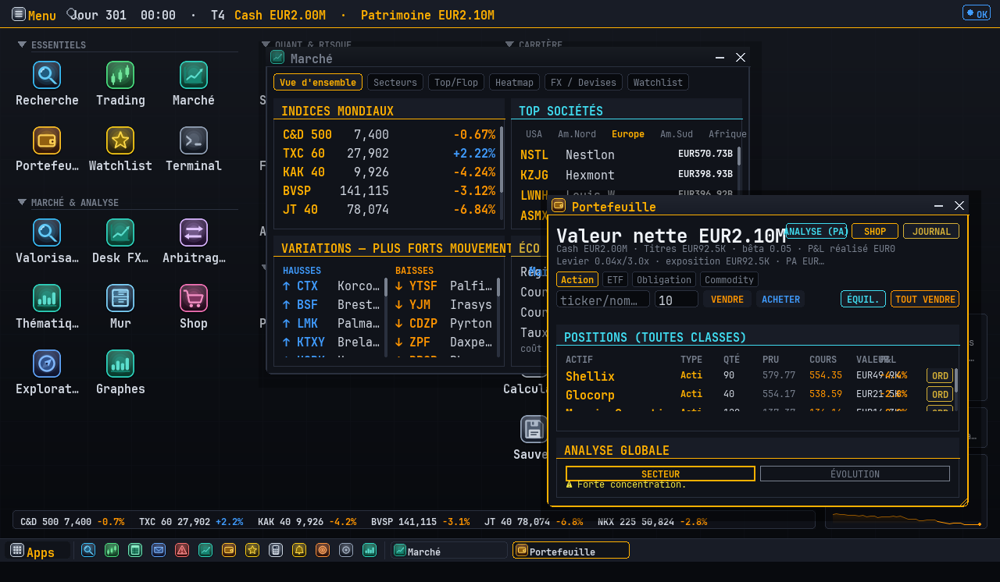
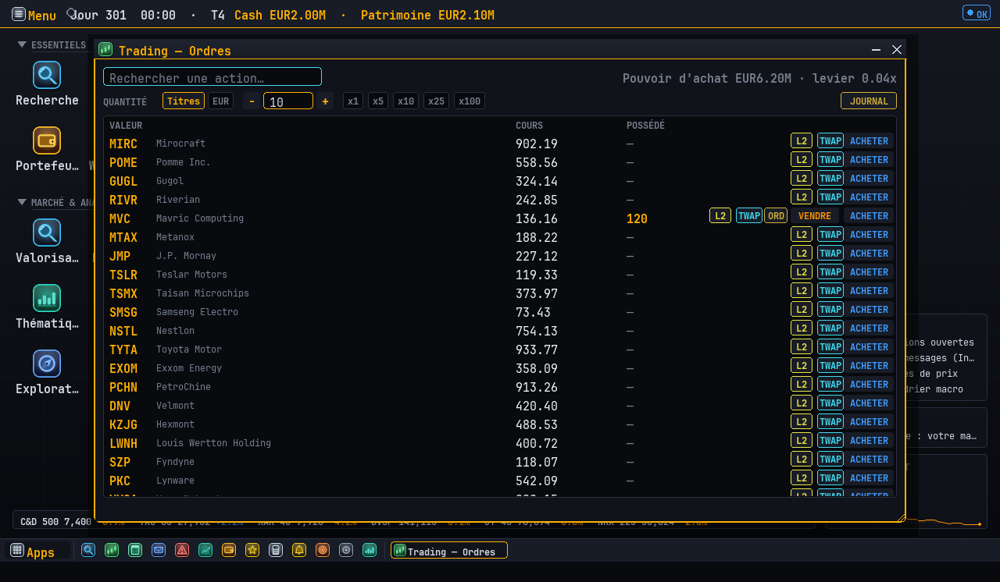
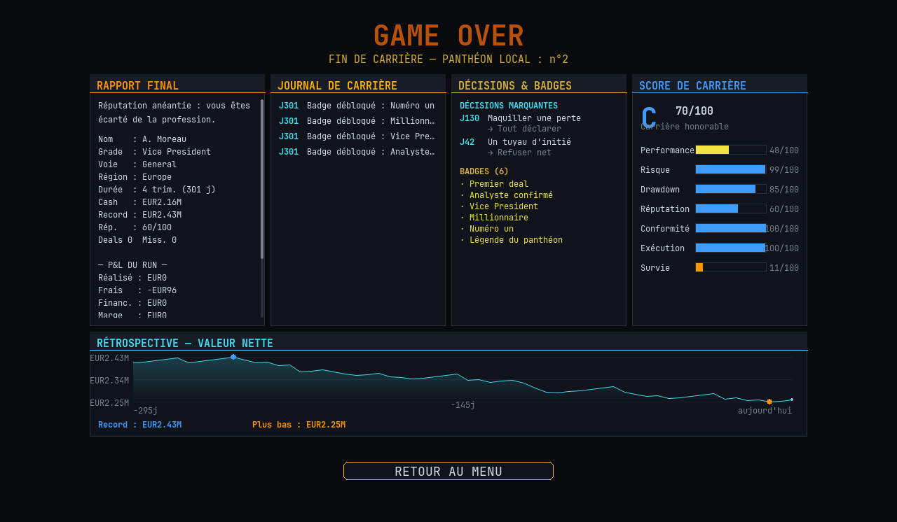

# TERMINAL — Finance Career Simulator

Simulateur de carrière en finance de marché (Python + pygame) : vous démarrez
stagiaire dans une salle des marchés et grimpez les 12 grades jusqu'au sommet,
en travaillant (missions, examens, deals, mandats) et en gérant un vrai
portefeuille multi-classes sur un **marché déterministe à modèle de facteurs**
— actions, ETF, obligations, commodities, crypto, FX, options, CDS, IRS, TRS,
repo, titrisation, convertibles, arbitrage de fusion…

Le jeu se joue sur un **poste de travail fenêtré** façon PC de trading : un
bureau avec ~40 applications qui s'ouvrent dans des fenêtres déplaçables,
redimensionnables, ancrables (glisser vers un bord, Alt+Tab, menu Démarrer,
palette Ctrl+K, recherche globale Ctrl+/). Le temps s'écoule en continu
(pause/x1/x2/x3) et le marché avance pendant que vous travaillez.



<p align="center">
  
  
</p>

*Captures générées automatiquement par `scripts/make_screenshots.py` (rendu
headless déterministe — les régénérer après un changement d'UI).*

## Vue d'ensemble

### Le poste de travail (bureau)
- **Bureau maître** : icônes rangées en sections repliables (Essentiels,
  Marché & Analyse, Quant & Risque, Crédit & Financement, Carrière, Outils),
  barre des tâches, widgets ambiants (patrimoine, À FAIRE, ticker d'indices).
- **Apps natives** : Recherche (type Bloomberg), Trading (ordres, TWAP, ordres
  conditionnels stop/target/trailing, profondeur de carnet L2), Portefeuille,
  Marché, Tableur multi-feuilles (formules, graphiques, fonctions de marché en
  direct `=PRICE()`, VLOOKUP, CSV, undo/redo), Inbox, Alertes, Watchlist,
  Journal de trading (+ critère de Kelly), Mission, Évaluation, Boutique…
- **Desks spécialisés** : Desk Options (5 modèles de pricing, stratégies,
  grecques, surface de vol, gamma scalping), Desk Taux (courbe, DV01, chocs,
  immunisation, IRS), Desk Crédit (Merton, waterfall de titrisation, CDS,
  convertibles, TRS), VaR desk (Euler, Kupiec), Frontière efficiente
  interactive, Pairs trading, Backtester, Labo de crise, Desk FX (carry),
  P&L Explain, Attribution Brinson, Valorisation (DCF/SML/LBO)…
- **Carrière** : 5 voies (Portfolio / M&A / Risk / Quant / Advisory) avec
  outils **exclusifs** par voie (Football Field, Pitch Book, Allocation
  stratégique), certifications (CFA/FRM/CQF), dilemmes éthiques, rivaux qui
  tradent, arcs narratifs, panthéon local et **Défi du jour** partageable
  entre amis par code copié/collé (sans serveur).

### Moteur financier (core/finmath.py) — formules réelles, toutes testées
- Valeur temps de l'argent : PV, FV, NPV, IRR
- Obligations : prix, duration de Macaulay, duration modifiée
- Valorisation : DCF, WACC, valeur terminale
- Options : Black-Scholes + Greeks (delta, gamma, vega, theta, rho)
- Portefeuille : rendement, volatilité, Sharpe, min-variance, max-Sharpe, efficient frontier
- Risque : VaR historique, CVaR, VaR paramétrique
- M&A : accretion/dilution, modèle LBO
- Ratios : ROE, ROA, marge nette, D/E, current ratio, interest coverage...

### Applications financières avancées
- **Sharpe Ratio** : Calcule et visualise le ratio de Sharpe pour différentes stratégies de portefeuille (actuel, benchmark, optimisé) avec graphiques comparatifs
- **Z-Score** : Analyse statistique avancée pour identifier les écarts significatifs dans les rendements, volatilité et corrélation avec tendances et confiance
- **Couverture (Hedge)** : Mise en place de stratégies de couverture delta, beta et statistique pour protéger un portefeuille avec évaluations d'efficacité

### Simulation de marché (core/market.py + data/companies.py)
- **320 sociétés fictives** réparties USA / Europe / Asie, sur 14 secteurs.
  Noms volontairement déformés (LVMH→**LWNH**, NVIDIA→**MVC**, S&P 500→**C&D 500**,
  CAC 40→**KAK 40**...). Roster **déterministe** (identique d'une partie à l'autre).
- **Modèle à facteurs** : chaque rendement = dérive + facteur monde + facteur secteur
  + facteur région + bruit propre. Conséquences réalistes *gratuites* :
  - les **indices émergent** de leurs constituants (le KAK 40 dépend de LWNH, le
    C&D 500 de MVC...) ;
  - **corrélations réalistes** entre valeurs et entre régions (~0,70) ;
  - une **crise** = un choc injecté sur les bons facteurs (2008 : monde + finance
    effondrés ; tornade : secteur agro ; etc.).
- Calibré (12 graines, 10 ans) pour une **prime de risque actions positive** :
  action moyenne ~**+7 %/an** (vs cash ~3 %, obligations IG ~5 %), volatilité
  ~**16 %**, indice phare ~**16 %** (dominé par les grandes capi). Une perte sur
  10 ans reste possible selon l'« époque » de marché.
- **Déterministe & léger** : l'état se reconstruit exactement via (graine, nb de pas),
  donc les sauvegardes restent minuscules et les prix sont reproductibles.
- **Carte du monde au centre** du terminal : hubs régionaux affichant l'indice phare,
  sa variation et la 1ʳᵉ société de la région ; les actualités « poppent » par région.
- **Fiches sociétés** type Bloomberg (`COMPANY <ticker>`) : capi, BPA, P/E, EV/EBITDA,
  marges, dette, dividende, bêta, graphe de cours.

### Missions par grade (core/missions.py + scene_mission.py)
Le travail change avec la carrière, et la réputation se gagne en l'effectuant :
- **Intern** : compte-rendu de données — texte à trous (capi, BPA, marge) + QCM sur une vraie société du roster.
- **Analyst** : lecture de graphes — tendance, rendement, volatilité, surperformance.
- **Associate** : décision — acheter / conserver / vendre selon P/E et momentum.
- **VP+** : construction & couverture de portefeuille (hedging, risk parity, bêta).

Chaque mission rapporte de la **réputation** (au prorata du score) + un honoraire.
L'**examen de promotion (EVAL) est verrouillé** tant que la réputation n'atteint pas
le seuil du grade (`MISSION` pour la faire monter). Commande : `MISSION`.

### Examens de promotion (refonte) & certifications
- **Examens générés** (core/exam.py) : chaque promotion = un « entretien technique » de
  **20 à 30 questions** (+1 par grade). **Taille de banque décroissante par grade** :
  ~**1000** questions pour Intern→Junior, ~900, … jusqu'à ~**300** aux grades élevés
  (plus de variété en bas, questions plus dures en haut). La capacité procédurale réelle
  dépasse largement ces cibles (8 000–12 000 variantes/grade) → **aucune répétition au rejeu**. Types : **calcul chiffré**, **QCM**, **lecture de graphe**,
  **définition à trous** et **formule à compléter** (sans chiffres) — difficulté calibrée
  sur le poste visé. Calculatrice et bouton SUIVANT intégrés.
- **Certifications** (`CERT`) : **CFA** (Portfolio), **FRM** (Risk), **CQF** (Quant). On paie
  des frais et on passe un examen exigeant ; une certification **liée à votre voie** booste
  fortement la réputation et **réduit les critères de promotion** (accès plus rapide aux hauts
  postes). Titre de prestige + badge à la clé. Certaines voies n'ont pas de certification.

### Confort de jeu
- **Calculatrice** intégrée et déplaçable dans les missions (bouton CALCULATRICE) :
  pavé cliquable, parenthèses, puissance, pour faire les calculs des questions sans quitter l'écran.
- **Évaluation** : après chaque réponse, l'explication s'affiche et un bouton **SUIVANT**
  (toujours visible) fait passer à la question suivante.

### Apprendre la finance & outils Bloomberg
- **Académie** (`LEARN`) : 15 leçons exactes et concises (P/E, EV/EBITDA, DCF, diversification,
  Sharpe, VaR/CVaR, bêta, options, Greeks, taux, courbe des taux, LBO, accretion/dilution,
  réflexes Bloomberg) — chacune avec **formule + exemple chiffré + à retenir**. Lire tout = badge « Diplômé ».
- **Macro-économie** (`ECO`) : taux directeur, inflation, croissance, chômage, confiance —
  qui évoluent et **influencent réellement le marché** (taux ↑ → finance/immobilier sous pression…).
- **Fonctions façon Bloomberg** : `DES`/`FA` (fiche), `GP` (graphe), `RV` (valeur relative vs pairs),
  `WEI` (indices), `EQS` (screener), `ECO`, `PRT` (portefeuille) + `DEFINE <terme>` (glossaire).
- **Fiche société enrichie** : ratios pros (P/S, FCF yield, dette/EBITDA, payout…) en 2 colonnes,
  et `RV <ticker>` situe chaque multiple face à la médiane du secteur (décoté / en ligne / cher).

### Monde élargi & confort
- **7 régions jouables** : USA, Amérique du Nord, Europe, Amérique du Sud, Afrique, Asie,
  Océanie — chacune avec régulateur, devise, indice (C&D 500, TXC 60, KAK 40, BVSP, JT 40,
  NKX 225, AX 200) et ses sociétés. Carte interactive avec 7 hubs (fiche au survol, clic = zoom).
- **Dividendes** : les positions versent un revenu passif à chaque tour (selon le rendement).
- **Secteur du trimestre** : un secteur mis en avant chaque trimestre pour guider l'investissement.
- **Terminal** : historique de commandes (↑/↓), **autocomplétion** (Tab + suggestion fantôme),
  **indices cliquables** ouvrant un graphe d'historique en fenêtre déplaçable.

### ETF — fonds indiciels (core/etfs.py + scene_etfs.py)
- **~80 ETF** couvrant toutes les grandes familles : *broad/monde, régions, pays,
  secteurs, styles factoriels* (value, growth, dividend, quality, momentum, min-vol),
  *thématiques* (IA, semis, robotique, cybersécurité, énergie propre, défense,
  infrastructure, fintech, biotech…), *ESG*, *REIT*, *obligataire* (souverain,
  corporate, high yield, indexé inflation, court/long terme), *commodities*, *devises*,
  et quelques **levier/inverse** clairement signalés « risque élevé ».
- **NAV émergente** : comme les indices, la valeur d'un ETF découle de son **exposition**
  (panier d'actions, taux, commodities…), donc il réagit de façon **cohérente** aux
  facteurs monde/secteur/région/taux/inflation — déterministe, reconstruit depuis les
  historiques du marché (5 ans d'historique dès le départ).
- Pleinement intégrés : recherche/filtres/tri (`ETF`), explorateur unifié, fiche
  flottante, **graphes** (`GP`/`COMP`), **comparaison** (`COMPARE`), portefeuille
  (valeur nette), trading (`BUYETF`/`SELLETF`).

### News & événements (core/news.py + scene_news.py)
- Scène **`NEWS`** : fil d'actualités centralisé, **filtrable par type** (marché, macro,
  entreprises, politique, réglementaire, événements) **et par région**, regroupé par jour.
- **Persistance jusqu'à 3 ans** : on peut revoir tout ce qui s'est passé depuis le début.
- **Carte du monde** : les news du jour s'affichent en **marqueurs persistants** là où
  elles se produisent (plusieurs incidents simultanés), remplacés au tour suivant.
- Les **news de pays** atterrissent dans l'inbox ; des **deals/mandats souverains**
  apparaissent quand c'est cohérent avec l'actualité politique (`DEALS`).
- **Santé financière** (`FA`) : analyse complète d'une société — stats clés, graphe de
  cours 5 ans, et **5 exercices** de compte de résultat & bilan.

### Contenu additionnel
- **Mandats clients** (`MANDATES`) : un client confie un capital avec un **objectif de
  rendement** sur N trimestres et une **limite de bêta** ; réussite → grosse commission +
  réputation, échec → réputation. `MANDATE ACCEPT/DECLINE <id>`. Débloqué dès Associate.
- **Recherche analyste** (`RESEARCH <ticker>`) : estime une **valeur intrinsèque** + une
  reco (ACHAT/NEUTRE/VENTE), affichée sur la fiche société.
- **Alertes de prix** (`ALERT <ticker> <prix>`) : notification (toast + email) au
  franchissement du seuil ; `ALERTS` pour la liste.
- Plus de **dilemmes** (front-running, greenwashing, notes de frais, restructuration),
  de **crises** (sanitaire, resserrement du crédit, vague d'IPO, matières premières) et
  de **badges** (Gestionnaire, Gérant d'élite, Diversifié, Œil de l'analyste).

### Refonte UX (Phase 7)
- **Format large** 1520×740 (plus d'espace horizontal, plus ramassé verticalement),
  layouts responsives et **footer réservé** : les boutons retour ne recouvrent plus le texte.
- **Terminal redessiné** : rail de commandes cliquable à gauche (ADV, MISSION, DEALS,
  MARCHÉ, TOP, PORTEF., INBOX, DÉCIDE, CARRIÈRE, RIVAUX…), 3 colonnes denses, console en bas.
- **Carte interactive zoomable** : clic sur une région → vue régionale avec tous les indices
  et les sociétés (cliquables vers leur fiche), retour ‹ MONDE.
- **Fenêtres de données déplaçables** (style Bloomberg) : `MARKET`, `TOP`, `SECTOR`,
  `SCREEN`, `COMPARE`, `MOVERS`, `WATCHLIST`, `RANKING`, `CALENDAR` ouvrent un tableau
  que l'on déplace par sa barre de titre et que l'on ferme.
- Catalogue de commandes réorganisé en 3 colonnes (plus aucun chevauchement).

### Finition premium (Phase 6)
- **Centre de notifications** : toasts animés (glissement + fondu) en overlay pour
  promotions, badges, crises, décisions, sanctions (`ui/notifications.py`).
- **Badges de prestige** (`core/badges.py`) : 15 succès débloqués par jalons (grade,
  deals, valeur nette, intégrité, crises survécues, 1ʳᵉ place du classement…), affichés
  dans l'écran carrière.
- **Hiérarchie visuelle** : palette de priorité (critique/urgent/bonus), panneaux à
  barre de priorité colorée (le panneau Priorités passe au rouge en cas de danger).
- **Polish** : boutons arrondis avec profondeur/relief, **menu vivant** (chandeliers
  animés en fond), résumé de la dernière partie.

### Décisions & éthique (core/dilemmas.py + scene_dilemma.py)
- **Dilemmes** qui surgissent au fil de la carrière : éthiques (délit d'initié,
  mis-selling), réglementaires (alerte risque ignorée, conflit d'intérêts), stratégiques
  (mandat chronophage, débauchage), et **décisions « signature »** rares et lourdes
  (méga-fusion, sauver la firme, dénoncer une fraude).
- Chaque option a un **coût et une conséquence clairs** : trésorerie, réputation, et
  **scrutin réglementaire** (jauge `heat`). Couper les coins paie à court terme…
- …mais un scrutin élevé peut déclencher une **enquête** : amende + réputation. Les choix
  s'enchaînent en vrais arbitrages cash / réputation / risque / timing.
- Déclenchés à l'`ADV` (ou `DECIDE` pour une décision en attente). Le scrutin s'affiche
  dans les priorités et l'écran carrière.

### Monde vivant (core/inbox.py · rivals.py · scenarios.py)
- **Messagerie** (`INBOX`) : emails contextuels du manager, des clients, de la
  conformité et du desk — félicitations de promotion, revue trimestrielle, alertes
  de risque/concentration, briefs de marché. Badge de non-lus dans le terminal.
- **Concurrents** (`RIVALS`) : banquiers rivaux nommés dont le score évolue avec le
  marché ; ils **raflent les deals** que vous laissez expirer. Classement joueur vs rivaux.
- **Crises déclenchées dans le temps** : krach systémique (type 2008), choc de taux
  (type 2023), catastrophe agricole, éclatement de bulle tech, choc énergétique,
  tensions en Asie… (+ booms). Elles frappent les indices **et votre portefeuille**.
- **Conséquences narratives** : promotions, crises, deals perdus et trimestres
  alimentent le journal de carrière et la messagerie.

### Portefeuille & P&L réel (core/portfolio.py + scene_book.py)
- **Acheter / vendre de vraies sociétés** du roster : `BUY <ticker> <qté>`, `SELL <ticker> <qté|ALL>`.
- **Prix de revient moyen**, commission, **P&L latent et réalisé**, **valeur nette** (cash + positions).
- Les positions **vivent avec le marché** : un krach fait réellement chuter la valeur nette,
  un bon choix la fait grimper (les chocs/crises frappent désormais le portefeuille).
- Commandes décisionnelles : `ALLOCATE <ticker> <pct>` (viser un % de la valeur nette),
  `HEDGE [pct]` (bêta / lever du cash), `REBALANCE` (poids égaux), `PITCH` (décrocher un mandat).
- Écran **PORTFOLIO / BOOK** : positions, P&L par ligne, bêta, répartition sectorielle.
- Liquidité : les coûts opérationnels se paient en cash → rester investi à 100 % est risqué.
- (L'outil frontière efficiente de Markowitz reste accessible via `FRONTIER`.)

### Déblocage progressif des actions (core/unlocks.py)
Pour canaliser le début de carrière puis monter en complexité, les actions se
débloquent par grade :
- **Stagiaire** : missions, apprentissage (LEARN), analyse en lecture (MARKET, COMPANY, ECO).
- **Junior Analyst (1)** : outils d'analyse (WATCHLIST, ALERT, COMPARE, RV, RESEARCH).
- **Analyst (2)** : traiter des **DEALS**, choisir une **voie**.
- **Associate (4)** : **investir** (BUY/SELL/ALLOCATE), démarcher des mandats (PITCH).
- **Vice President (6)** : **mandats clients**, **couverture** (HEDGE).
Les commandes/boutons verrouillés affichent un cadenas et le grade requis ; le terminal
indique le **prochain déblocage**.

### Carrière & progression (core/career.py + scene_career.py)
- **12 grades** : Intern → Junior Analyst → Analyst → Senior Analyst → Associate →
  Senior Associate → VP → Senior VP → Director → Executive Director → MD → Partner
  (début / milieu / fin de carrière).
- **Promotion par critères combinés** (plus seulement le QCM) : réputation **+** missions
  du grade **+** deals conclus **+** ancienneté. L'examen `EVAL` ne s'ouvre que si tous
  les critères sont remplis.
- **Objectifs trimestriels** (2 à 4 cibles : réputation, missions, deals, trésorerie)
  récompensés en réputation + honoraire ; **bonus « trimestre parfait »**.
- **Titres de prestige** liés à la voie (Rainmaker, Risk Guardian, Quant Star…).
- **Journal de carrière** (promotions, deals, crises, objectifs) + **bilan de fin** rétrospectif.
- Écran **CAREER** : échelle des grades, roadmap de promotion, objectifs, stats de run, journal.
- **Panneau « Priorités »** dans le terminal : prochain objectif, promotion, risque, opportunité.

### Système de jeu
- 12 grades, du stagiaire au Partner / C-Suite.
- Réputation, trésorerie, sauvegarde/chargement JSON, autosave.
- **Temps qui avance** (commande `ADV`) : +5 jours par tour, calendrier en trimestres,
  salaire et coûts opérationnels croissants avec le grade.
- **Événements de marché dynamiques** : rallyes, sell-offs, appels de marge, amendes,
  événements régionaux... impactant cash et réputation (cf. `core/events.py`).
- **Deals à délai** (`DEALS`, `DEAL <id>`) : opportunités générées avec échéance ;
  réussite probabiliste selon réputation/difficulté, pénalité si expirées (cf. `core/deals.py`).
- **Faillite / réputation nulle → game over** (écran de fin avec récap de carrière).
- **Mode hardcore** (sélectionnable à la création) : pas de sauvegarde manuelle,
  faillite = run définitivement perdu.
- **Gestion des sauvegardes** : autosave + 3 slots manuels, métadonnées (grade, jour,
  cash, date), chargement et suppression depuis l'UI.
- **Polish visuel** : fondu de transition entre scènes, sparklines d'historique,
  feedback d'appui sur les boutons, marges cohérentes.

## Démarrage
Au lancement d'une **nouvelle carrière**, un **guide multi-pages** explique
l'objectif du jeu et son fonctionnement (boucle missions → réputation →
examen → promotion, temps continu, outils du grade), puis un tutoriel guidé
du bureau prend le relais. Une nouvelle partie atterrit directement sur le
**bureau** ; le terminal classique reste accessible en fenêtre.

```bash
pip install -r requirements.txt        # pygame, numpy, scipy
python main.py                         # jeu normal
python main_cheat.py                   # jeu + triches (GRADE/CASH/REP…)
```

## Tests

Suite pytest (~200 fichiers de tests : formules financières, déterminisme du
marché, portefeuille/levier, desks, apps du bureau, smoke test headless de
chaque scène, fixtures de compatibilité des sauvegardes) :

```bash
pip install numpy scipy pytest pygame
SDL_VIDEODRIVER=dummy SDL_AUDIODRIVER=dummy pytest
```

### Profilage du rendu

Au-delà de l'overlay live `FINSIM_DEBUG=1` (FPS + décomposition de la frame,
`ui/perf_overlay.py`), un profileur **headless** mesure le coût de rendu de
chaque scène de façon reproductible :

```bash
SDL_VIDEODRIVER=dummy SDL_AUDIODRIVER=dummy python scripts/profile_scenes.py
python scripts/profile_scenes.py --profile analytics   # cProfile d'UNE scène
```

Il classe les scènes par temps de frame et pointe la plus lourde ; `--profile
<scène>` sort le détail fonction-par-fonction (le vrai goulot, pas la
supposition). C'est cet outil qui a révélé que trois écrans recalculaient une
optimisation de frontière efficiente ou des centaines de mesures de texte à
chaque frame — désormais mis en cache (verrous dans `tests/test_perf_caches.py`).

## Installation sur Mac (PyCharm)

```bash
pip install -r requirements.txt
python main.py
```

## Commandes du terminal (in-game)

| Commande   | Effet                                   |
|------------|-----------------------------------------|
| `HELP`     | Aide rapide                             |
| `COMMANDS` / `?` | Catalogue complet des commandes   |
| `STATUS`   | Situation actuelle (grade, cash, rép.)  |
| `ADV`      | Avancer le temps (+5 jours, 1 pas marché)|
| `ADV Q`    | Avancer jusqu'au trimestre suivant (s'arrête net sur le premier évènement bloquant) |
| `PORTFOLIO`/`BOOK` | Livre de positions (valeur nette, P&L) |
| `BUY`/`SELL`/`ALLOCATE`/`HEDGE`/`REBALANCE` | Trading |
| `RESEARCH <tk>` / `ALERT <tk> <px>` | Analyse & alertes |
| `MANDATES` / `MANDATE ACCEPT <id>` | Mandats clients |
| `LEARN` / `DEFINE <terme>` | Académie / glossaire |
| `ECO` · `RV <tk>` · `GP <tk>` · `WEI` · `EQS` | Fonctions style Bloomberg |
| `PITCH` / `FRONTIER` | Mandat client / outil Markowitz |
| `MISSION`  | Mission du grade (réputation + honoraire)|
| `INBOX`/`MAIL` | Messagerie (manager, clients, conformité, desk) |
| `RIVALS`   | Classement face aux concurrents          |
| `DECIDE`   | Trancher un dilemme en attente           |
| `CAREER`   | Tableau de bord : roadmap, objectifs, stats, journal |
| `EVAL`     | Examen de promotion (critères combinés)  |
| `WATCHLIST`/`COMPARE`/`SECTOR`/`REGION` | Outils d'analyse |
| `SCREEN`/`RANKING`/`BENCHMARK`/`CALENDAR` | Filtres & repères |
| `MARKET`   | Vue des indices mondiaux                |
| `TOP [region]` | Meilleures sociétés d'une région    |
| `MOVERS`   | Plus fortes hausses / baisses           |
| `COMPANY <tk>` | Fiche société (ex: `COMPANY MVC`)   |
| `SEARCH <txt>` | Rechercher une société              |
| `DEALS`    | Lister les deals en cours               |
| `DEAL <id>`| Traiter un deal avant son échéance      |
| `EVAL`     | Passer l'évaluation de promotion        |
| `PORTFOLIO`| Module portefeuille (efficient frontier)|
| `MA`       | Module M&A (LBO, accretion/dilution)    |
| `RISK`     | Module risque (VaR/CVaR, stress tests)  |
| `QUANT`    | Module quant (Black-Scholes, Greeks)    |
| `SHEET`    | Tableur intégré                         |
| `GLOSSARY` | Ouvrir le glossaire                     |
| `TRACK`    | Choisir une voie de spécialisation      |
| `SAVES`    | Gestion des sauvegardes                  |
| `ETF` / `ETFS` | Marché des ETF (filtres/tri/trading), `BUYETF`/`SELLETF` |
| `BONDS` · `CMDTY` · `CRYPTO` | Marchés obligataire / commodities / crypto |
| `SAVE`     | Sauvegarde manuelle (hors hardcore)     |
| `NEWS`     | Scène News & événements (filtres par type/région, historique 3 ans) |
| `MORE` / `PLUS` | Toutes les pages (raccourcis vers chaque scène) |
| `REG`      | Rappel réglementaire de la région       |
| `MENU`     | Retour au menu (ou ESC)                 |

## Structure

```
finance_game/
├── main.py
├── requirements.txt
├── core/
│   ├── config.py        palette, grades, continents
│   ├── game_state.py    joueur + save/load
│   ├── scene_manager.py machine à scènes
│   └── finmath.py       MOTEUR FINANCIER (testé)
├── ui/
│   ├── fonts.py  widgets.py  globe.py
├── data/
│   ├── glossary_data.py    48 termes
│   └── question_bank.py    banque de questions
└── scenes/
    ├── scene_menu / continent / terminal
    ├── scene_evaluation / glossary / track
    └── scene_portfolio / scene_ma
```

## Packaging (.app / .exe)

```bash
pip install -r requirements.txt -r requirements-build.txt
python build.py --clean
```

Résultat dans `dist/` :
- **macOS** : `dist/TERMINAL.app` (bundle double-cliquable)
- **Windows** : `dist/TERMINAL.exe` (lancer la même commande sous Windows)

La recette est dans `terminal.spec` (cross-plateforme). Icônes optionnelles :
déposer `assets/icon.icns` (Mac) ou `assets/icon.ico` (Windows). En version packagée,
les sauvegardes sont écrites dans l'espace utilisateur (`~/Library/Application Support/TERMINAL-FinanceSim`
sur Mac, `%APPDATA%` sur Windows).

## Prochaines étapes
- Playtests avec des joueurs neufs (le contenu est là ; le prochain levier,
  c'est la digestion — cf. le suivi de découverte des apps dans
  `core/profile.py::apps_never_opened`).
- Équilibrage fin de l'économie (salaires, amplitude des événements).
- Signature/notarisation du `.app` pour distribution hors développeur.

## Historique de développement

La chronologie détaillée des refontes (bureau fenêtré, desks avancés, lots de
contenu) est dans [`docs/HISTORY.md`](docs/HISTORY.md) ; les conventions et
invariants pour contribuer sont dans [`CLAUDE.md`](CLAUDE.md).
